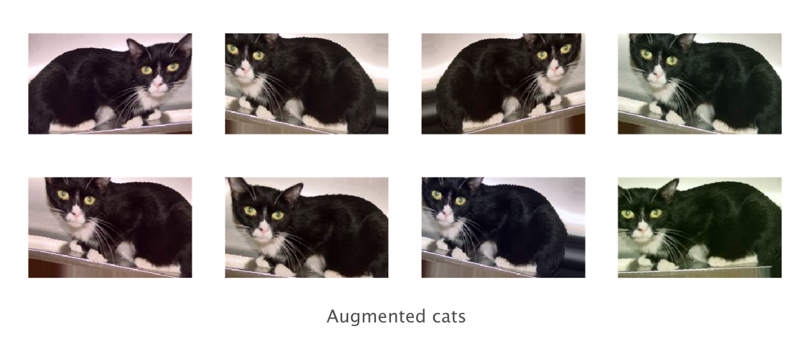

# Comparison of two NN-models using MNIST dataset


## Problem Description
The MNIST database of handwritten digits has a training set of 60000 examples and a test set of 10000 examples. 
There have been many methods tested within the training and test set. 
The current approach will comprise two different deep learning models and their comparison.


## Prerequisites 
* Python IDE
* Theano library 

* Tensorflow library 

* Keras 

* For GPU implementations, consult [Using GPUs](https://www.tensorflow.org/guide/using_gpu)

## My Solution

### Deep Learning Models
I have chosen CNN and LSTM models to train on the MNIST dataset. My choice of deep learning models is discussed below.

#### CNN
In general, Convolutional Neural Networks, or CNNs, were designed to map image data to an output variable.
The effectiveness of CNN models has made them to be almost a benchmark method for any type of predictive problems involving image-type data as an input.
CNN perform well on data that has a spatial relationship. Unsurprisingly, CNN is my model to-go with to run a predictive analysis on MNIST dataset. 

#### RNN - LSTM 
Recurrent Neural Networks, or RNN, were designed to work with sequential data.
Sequence problems may come in many different forms. For example, we can think of one dimension of an image being a time step, 
and another a feature. Thus, for each image in MNIST with width and height of 28x28 we can assume it has 28 time steps with 28 features within each of them.
To deal with exploding and vanishing gradient problems - the common problems for traditional RNN models, the Long Short-Term Memory, or LSTM, network is perhaps the most useful approach.
Thus, the second deep learning model for MNIST data analysis in my case is LSTM. 

### Architecture
#### CNN
The good thing is that MNIST dataset is well known and there are many approaches are published in the web.
A quick search among publications allowed me to locate a paper by [Sabour, Frosst & Hinton (2017)](https://arxiv.org/pdf/1710.09829.pdf). 
In the paper, authors discuss a new approach to CNN architecture based on concept of a capsule - a group of neurons with activity vector
as instantiation parameters of a specific entity (object or its part). Aside note for curious mind: capsules at one level make predictions via transformation matrices
for instantiation parameters of higher level capsules, with multiple predictions aligned the system activates a higher-level capsule.
Very interesting reading - highly recommended. The baseline model the authors mentioned is a standart CNN with 3 convolutional layers: 256x256x128
with 5x5 kernels and stride of 1. The last convolutional layer is followed by one fully connected layer of size 328 
(small discrepancy with the paper in my case such that the authors describe two fully connected layers). The last fully connected layer is connected with dropout to a 10 class softmax layer
with cross entropy loss. The model is trained with use of Adam optimizer. This model is designed to achieve the best performance on MNIST dataset, thus its architecture was used for my current project. 

#### LSTM
I didn't find any specific papers delivering a 'ready-to-use' architecture for LSTM model to perform well on MNIST. 
I had more flexibility "to try, fail and learn" within limited time frame. I have started with very basic LSTM model with one LSTM layer and 50 memory units.
The accuracy and loss function could be improved. So, the latest version of my LSTM has 4 LSTM layers with 250 memory units. I also included an output layer with 10 neurons.
Because it's a classification problem, I use a softmax function as an output layer to allow for separate probabilities for each of ten digits. 
As in the previous model, I also use a cross-entropy loss as it comes from a probabalistic interpretaion of binary classification.

### Implementation
Both models are trained with a batch_size of 64 and 50 epochs. 
I have encountered the problem of computational limitations. Considering a time constraint, my solution was to run my models on a subset of MNIST dataset.
My training set consists 1000 image samples from MNIST original training set. My test set comprised 200 image samples from MNIST original test set. 
It can be easily tweaked in the code to return a full size to run on more powerful machines. 

Code is available in the appropriate files **mnist_cnn.py** and **mnist_rnn.py**

### Results
My CNN model runs for 3 hours with 35M parameters on a standard MacBook Pro CPU computational power. 

```
# Evaluate performance of CNN model  
score = model_cnn.evaluate(X_test, y_test, verbose=0)
print('Test cross-entropy loss: %0.5f' % score[0])
print('Test accuracy: %0.2f' % score[1])
Test cross-entropy loss: 0.03894
Test accuracy: 0.9850
```

The back propagation algorithm converges.
<!DOCTYPE html>
<html lang ='en'>
<body>
   
</body>
</html>

The validation accuracy is 0.9850, the validation error is 1.5%. 
Out of 200 test images there are 3 handwritten images that were incorrectly classified. 

The visualization of 9 first digits correctly predicted:


And 3 digits that were predicted incorrectly:


My LSTM model is comparatively more simplistic with only 1.8M parameters. Takes only minutes to run (although I am using a bit more powerful CPU in this case).

```
# Evaluate performance of RNN (LSTM) model
In [9]: scores = model_rnn.evaluate(X_test, y_test, verbose = 1)
   ...: print('Test cross-entropy loss:', scores[0])
   ...: print('Test accuracy:', scores[1])
200/200 [==============================] - 0s 2ms/step
Test cross-entropy loss: 0.43750
Test accuracy: 0.9050
```

The learning trajectory:
   

The validation accuracy is 0.9050, the validation error is 9.5%.
Out of 200 test images there are 19 that were incorrectly predicted. 

Vusialisation of 9 first digits from the series of correctly and incorrectly predicted digits:


## Choice
My choice is obvious. CNN architecture I used is created to perform well. 
By adding one more fully connected layer and tweaking a bit hyperparameters of a model, 
assuming I could launch tensorflow on GPU 
(after N hours of search for an appropriate machine and general research, the launch appeared to be unrealistic
considering a limited time frame), I would most likely achieve even better accuracy. 
According to Sabour et al. (2017) it is possible. 


## Normalization (normalized / unnormalized data)
Normalization is a rescaling of data from its original range to a range of 0 and 1. 
To avoid need to learn the invariance of scale, it perceived to be a good practice to normalize data.

However, to my surprise, when, out of curiosity, I took my LSTM model (simply because I can run it within minutes)
and run it on unnormalized data, I received better performance (more accurate results):

```
Test cross-entropy loss: 0.3035
Test accuracy: 0.935
```
The validation accuracy improved by 0.03, with validation error decreasing by 3% (!) to 6.5%.
The need for normalization depends on the algorithm. I would expect normalization making no harm, however, 
after some research into subject, I understood that if my attributes have comparable and meaningful scale then
normalization can actually bring more harm and negatively affect important information.
I would definitely spend more time playing around and trying on my CNN, but the important moment one must comprehend
is that understanding ones data is essential. Normalization isn't a panacea without a thorough understanding of a data. 

## Regularization (overfitting and its cure)
Overfitting happens when the model learns to perform too well on the training set, 
and fails to be generalized on other samples of data. One of the signs of overfitting could be the case
when the validation accuracy is improving with number of epochs while validation loss starts to increase at some point.
We can also observe that training loss is decreasing as well. It happened to my LSTM at the first stages of its basic formation.

In my case, I cured the overfitting by two simple techniques: 
1. First and foremost I was still working on architecture, so I was constantly improving my LSTM and it could learn
to generalize well. For example, I added more layers and memory units, more epochs.
2. During formation I used even smaller subsets of data. By adding more data points I was able to increase discrepancies in the patterns so my model won't "get too familiar" with what it fed with during training stage. 

Other useful technique I would go for having a bit of additional time is augmentation. 
Augmentation allows to randomly rotate the image, zoom it in, add a color filter, or basically 
to induce some noice to stop overfitting. I really liked the example with a cat I accidentally came across.


Image alterations can be done by importing [ImageDataGenerator class provided by Keras.](https://keras.io/preprocessing/image/)

Adding penalties [L1 (Laplacian) and L2 (Gaussian)](https://medium.com/greyatom/what-is-underfitting-and-overfitting-in-machine-learning-and-how-to-deal-with-it-6803a989c76) 
to our cost function is another useful way to battle overfitting.
Finally, I could also address overfitting by incorporating a dropout, or reduction of number of neurons to reduce interdependent learning among them. In my example of LSTM model, I was considering incorporating dropouts of 20% of neurons after each LSTM layer. 
However, there are few observations should be taken into account before using it. In my case the important fact was that [dropouts double the number of iterations needed for convergence.](https://medium.com/@amarbudhiraja/https-medium-com-amarbudhiraja-learning-less-to-learn-better-dropout-in-deep-machine-learning-74334da4bfc5)
By experimenting, I left dropouts out of the scenery, my back propagation algorithm seemed to converge anyway.
However, there is a definite room for more experiments.

### Acknowledgments
Besides those i mentioned in the comments for my code, I would like to express my appreciation to:
* https://machinelearningmastery.com
* a number of blog posts on https://medium.com
* https://github.com/sorki/python-mnist
* Yumi's blog
* a number of GitHub repositories for educational purposes


